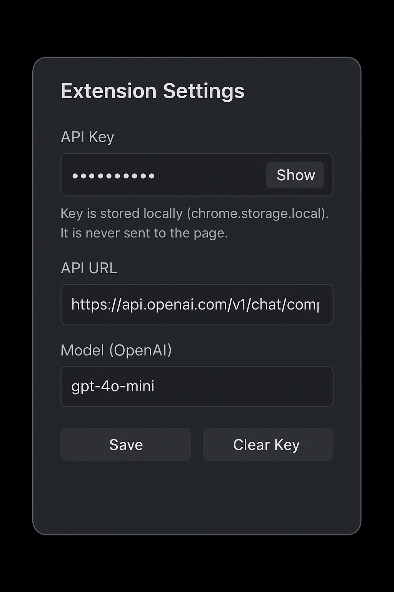

# 🤖 Chatbot Extension

A minimal Chrome extension that adds a sidebar chatbot to any webpage.  
It interacts with the **OpenAI API** through a background script and displays the responses directly inside the page.

---

## ⚡ About this project

This extension was generated iteratively through prompts with **ChatGPT (GPT-5)**.  
The code style is consistent with AI-generated output and kept simple on purpose,  
so others can easily **read, modify, and expand it**.

---

## 📦 Features

- 🔑 **Popup UI** for securely saving API key, endpoint URL, and model  
- 🪟 **Sidebar chatbot UI** (toggle with a floating button on webpages)  
- 🔒 API key is stored in `chrome.storage.local` and never exposed to content scripts  
- 📝 Chat log with user & bot messages  
- ⌨️ Enter to send / Shift+Enter for newlines  
- 🎨 Simple dark theme with CSS customization  

---

## 🔧 Setup

1. Clone or download this repo.  
2. Open **Chrome** and go to `chrome://extensions/`.  
3. Enable **Developer Mode** (top right).  
4. Click **Load unpacked** and select this project folder.  
5. In the **popup UI**, set your OpenAI API key and model.  

---

## 🚀 Usage

- Click the **hamburger button** (top right of the webpage) to open/close the sidebar.  
- Type your question in the text box and press **Enter** (or click **Send**).  
- The chatbot will reply with the OpenAI API response.  

---

## 🖼️ Screenshots

> Note: These are **mockup images** generated for documentation.  
> The actual UI may look slightly different when you load the extension.

### 🔑 Popup UI – API Key & Model Setup

### 💬 Sidebar Chatbot UI

---

## 🛠️ Contribution

Feel free to fork and extend this project:  

- Add support for different models  
- Store chat history  
- Context-aware prompts (use active page text/URL)  
- UI themes & animations  

---

## 🧪 Testing

For quick prototyping of the extension’s static files, you can pair this project with the  
[Live Reload Development Server](https://github.com/x91823903819038219083190/live-reload-development-server).  

This is optional — the extension works on its own, but the server helps during development  
by automatically reloading the browser when you edit files.

---

## 📜 License

MIT License – free to use, modify, and share.  

